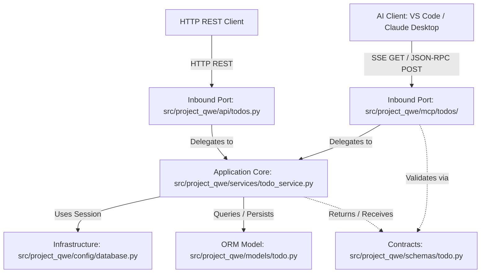
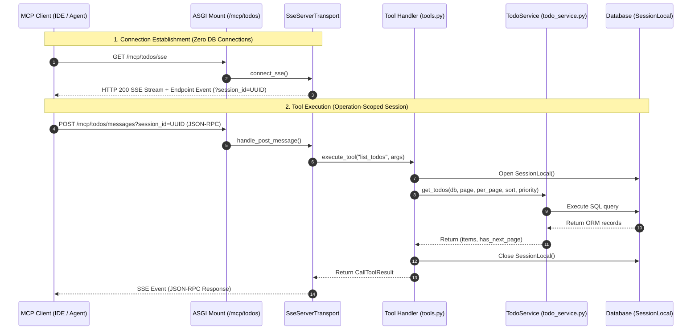

# Architecture Spine — Todo MCP Server

## Design Paradigm

This architecture follows the **Ports and Adapters (Hexagonal Architecture)** design paradigm:
* **Inbound Protocol Adapter (`src/project_qwe/mcp/todos/`):** Translates MCP JSON-RPC protocol messages and SSE transport events into strongly-typed domain requests and responses. It sits alongside the REST adapter (`src/project_qwe/api/todos.py`) as a parallel inbound port.
* **Application Core (`src/project_qwe/services/todo_service.py`):** Encapsulates all domain logic, transaction boundaries, query assembly, and business rules. It is entirely protocol-agnostic.
* **Contracts (`src/project_qwe/schemas/todo.py`):** Canonical Pydantic schemas shared across adapters and services.
* **Infrastructure & Persistence (`src/project_qwe/models/todo.py`, `src/project_qwe/config/database.py`):** Owns ORM models, migrations, and database engine/session provisioning.



---

## Invariants & Rules

### AD-1 — Lightweight Ports & Adapters Isolation [ADOPTED]

- **Binds:** `src/project_qwe/mcp/todos/*`, `src/project_qwe/services/todo_service.py`
- **Prevents:** Domain logic leakage into transport adapters, direct ORM model coupling, and divergence between REST and MCP behaviors.
- **Rule:** Handlers in `src/project_qwe/mcp/todos/` (tools, resources, prompts) must only interact with `src/project_qwe/services/todo_service.py` and `src/project_qwe/schemas/todo.py`. Direct imports of SQLAlchemy ORM models from `src/project_qwe/models/` or raw database queries inside MCP handlers are strictly prohibited.

### AD-2 — FastAPI ASGI Sub-Application Mounting [ADOPTED]

- **Binds:** `src/project_qwe/main.py`, `src/project_qwe/mcp/todos/server.py`
- **Prevents:** Incompatible ASGI streaming wrapping, middleware timeouts on persistent SSE connections, and OpenAPI/Swagger schema corruption.
- **Rule:** The Todo MCP server must be mounted directly as a dedicated ASGI sub-application using `app.mount("/mcp/todos", mcp_todos_app)`. It must interface with `mcp.server.sse.SseServerTransport` directly and must not be wrapped inside standard FastAPI `APIRouter` route definitions.

### AD-3 — Operation-Scoped Database Sessions [ADOPTED]

- **Binds:** `src/project_qwe/mcp/todos/tools.py`, `src/project_qwe/mcp/todos/resources.py`
- **Prevents:** Database connection pool exhaustion caused by persistent SSE streaming connections.
- **Rule:** The persistent SSE connection loop must hold zero open database connections. Database sessions must be acquired from `SessionLocal()` strictly via context managers for the execution span of individual tool calls or dynamic resource resolutions, and committed or rolled back and closed immediately upon completion.

### AD-4 — Multi-Instance In-Memory Session Stickiness [ADOPTED]

- **Binds:** AWS Deployment Configuration, ALB Target Groups for `/mcp/*`
- **Prevents:** HTTP 404 "Could not find session" errors caused by client POST messages routing to a container instance that does not hold the in-memory stream writer.
- **Rule:** Because Python MCP SDK's `SseServerTransport` maintains session stream writers in process memory, multi-instance deployments behind an AWS Application Load Balancer (ALB) must configure cookie-based target group stickiness on `/mcp/*`. Single-instance and local development environments require no stickiness configuration.

### AD-5 — Service-Owned Search and Multi-Field Sorting [ADOPTED]

- **Binds:** `src/project_qwe/services/todo_service.py`, `src/project_qwe/mcp/todos/tools.py`
- **Prevents:** In-memory full-table filtering in tool handlers, query performance regressions, and logic duplication across adapters.
- **Rule:** Keyword text search (`search_todos`) and multi-criteria sorting (`due_at` ascending with nulls last, followed by `priority` descending) must be implemented inside `src/project_qwe/services/todo_service.py` at the SQL query level, and consumed directly by `src/project_qwe/mcp/todos/tools.py`.

---

## Consistency Conventions

| Concern | Convention |
| :--- | :--- |
| **Directory Hierarchy** | Domain-isolated sub-packages under `src/project_qwe/mcp/<domain>/` (e.g. `src/project_qwe/mcp/todos/`). |
| **Tool Naming** | Snake_case matching action verbs: `list_todos`, `get_todo_by_id`, `search_todos`, `create_todo`, `update_todo`, `delete_todo`. |
| **Resource URIs** | Standardized scheme `todo://` with path hierarchy: `todo://items`, `todo://items/:id`, `todo://summary`, `todo://priorities/:priority`. |
| **Prompt Identifiers** | Snake_case workflow identifiers: `daily_planning`, `triage_backlog`, `task_breakdown`. |
| **Error Handling** | Unhandled exceptions and validation errors must return MCP standard `CallToolResult(isError=True, content=[TextContent(type="text", text=...)])` rather than raising uncaught 500 exceptions. |
| **Keep-Alive Heartbeat**| SSE transport must emit keep-alive comments or ping events every 15 to 30 seconds to maintain persistent connections across proxies and ALBs. |

---

## Stack

| Name | Version |
| :--- | :--- |
| Python | 3.14.0 |
| FastAPI | 0.141.1 |
| SQLAlchemy | 2.0.51 |
| mcp (with cli) | 2.2.0 |
| Pydantic | 2.10.0 |
| Uvicorn | 0.34.0 |
| Alembic | 1.19.1 |

---

## Structural Seed

### Directory Tree

```text
src/project_qwe/
  mcp/
    __init__.py
    todos/
      __init__.py
      server.py       # ASGI sub-app with SseServerTransport and endpoint routing
      tools.py        # Tool handlers (list, get_by_id, search, create, update, delete)
      resources.py    # Resource URI handlers (items, summary, priorities)
      prompts.py      # Guided prompt definitions (planning, triage, breakdown)
      __main__.py     # Local execution runner for development
```

### Request Flow & Session Boundary



---

## Capability → Architecture Map

| Capability / Requirement | Lives in | Governed by |
| :--- | :--- | :--- |
| **FR-1, FR-2, FR-3** (SSE Transport & Mount) | `src/project_qwe/mcp/todos/server.py`, `src/project_qwe/main.py` | AD-2, AD-4 |
| **FR-4, FR-5** (Session & Domain Boundaries) | `src/project_qwe/mcp/todos/tools.py`, `src/project_qwe/config/database.py` | AD-1, AD-3 |
| **FR-6** (`list_todos` Tool & Bounds) | `src/project_qwe/mcp/todos/tools.py`, `src/project_qwe/services/todo_service.py` | AD-1, AD-5 |
| **FR-7** (`get_todo_by_id` Tool) | `src/project_qwe/mcp/todos/tools.py` | AD-1 |
| **FR-8** (`search_todos` Tool) | `src/project_qwe/mcp/todos/tools.py`, `src/project_qwe/services/todo_service.py` | AD-1, AD-5 |
| **FR-9, FR-10, FR-11** (CRUD Tools) | `src/project_qwe/mcp/todos/tools.py` | AD-1 |
| **FR-12, FR-13, FR-14, FR-15** (Resources) | `src/project_qwe/mcp/todos/resources.py` | AD-1, AD-3 |
| **FR-16, FR-17, FR-18** (Prompts) | `src/project_qwe/mcp/todos/prompts.py` | AD-1 |
| **NFR-1, NFR-2, NFR-3** (Latency, Protocol, Errors) | `src/project_qwe/mcp/todos/tools.py` | AD-1, AD-2 |
| **NFR-4, NFR-5** (Security, ALB Keep-Alive) | `src/project_qwe/mcp/todos/server.py`, AWS ALB Config | AD-2, AD-4 |

---

## Deferred

* **Distributed Session Store (Redis pub/sub):** Python MCP SDK currently maintains SSE stream readers in-memory. Cross-instance routing without ALB cookie stickiness is deferred until the upstream MCP SDK supports pluggable external pub/sub transports.
* **Per-Tool Fine-Grained OAuth Scopes:** Scoped permissions (e.g. read-only vs write) on individual MCP tools are deferred until multi-tenant user authentication is integrated into the core application.
