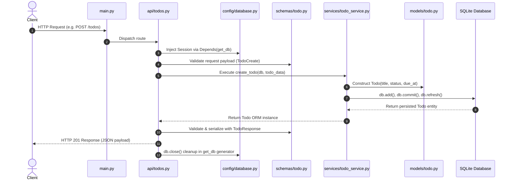

# Todos API Architecture & Process Flow

This document details the end-to-end architecture and lifecycle of requests in the Todos API for `project_qwe`.

---

## 1. Overview & Layered Architecture

The application strictly follows a 4-tier layered architecture:

```text
HTTP Request (Client)
        ↓
FastAPI Router (`src/project_qwe/api/todos.py`)
        ↓
Pydantic Schemas (`src/project_qwe/schemas/todo.py`) [Validation]
        ↓
Service Layer (`src/project_qwe/services/todo_service.py`) [Business Logic]
        ↓
SQLAlchemy ORM Model (`src/project_qwe/models/todo.py`) & Database (`data/development.sqlite`)
        ↓
HTTP Response (Client)
```

---

## 2. Sequence Diagram



---

## 3. Layer Breakdown & File Mapping

### A. Routing Layer (`src/project_qwe/api/todos.py`)
* **Prefix:** `/todos` (Tags: `["todos"]`)
* **Mounted in:** `src/project_qwe/main.py` via `app.include_router(todos_router)`
* **Endpoints:**
  * `GET /todos` (`get_todos`): Retrieves all todo records.
  * `GET /todos/{todo_id}` (`get_todo`): Fetches a single todo by ID or raises `404 Not Found`.
  * `POST /todos` (`create_todo`): Creates a new todo (Status `201 Created`).
  * `PUT /todos/{todo_id}` (`update_todo`): Updates existing todo fields or raises `404 Not Found`.
  * `DELETE /todos/{todo_id}` (`delete_todo`): Removes a todo or raises `404 Not Found`.
* **Convention:** Route handlers are thin delegates; no domain logic or raw database queries exist here.

### B. Validation & Schema Layer (`src/project_qwe/schemas/todo.py`)
* **`TodoBase`**: Defines common fields:
  * `title`: `str` (required, `min_length=1`)
  * `status`: `TodoStatus` enum (`created`, `inprogress`, `completed`)
  * `due_at`: `datetime | None` (optional)
* **`TodoCreate`**: Inherits from `TodoBase`.
* **`TodoUpdate`**: Partial update model with all fields optional.
* **`TodoResponse`**: Response serialization model (`ConfigDict(from_attributes=True)`):
  * `id`: `int`
  * `title`: `str`
  * `status`: `TodoStatus`
  * `due_at`: `datetime | None`
  * `created_at`: `datetime`
  * `updated_at`: `datetime`

### C. Business Logic & Service Layer (`src/project_qwe/services/todo_service.py`)
* **`create_todo(db: Session, todo_data: TodoCreate) -> Todo`**:
  * Constructs the `Todo` ORM model.
  * Commits transaction and handles rollback on database exceptions.
* **`get_todos(db: Session) -> Sequence[Todo]`**:
  * Executes `select(Todo).order_by(Todo.id)`.
* **`get_todo_by_id(db: Session, todo_id: int) -> Todo | None`**:
  * Executes `select(Todo).where(Todo.id == todo_id)`.
* **`update_todo(db: Session, todo_id: int, todo_data: TodoUpdate) -> Todo | None`**:
  * Applies modified fields, commits, and returns updated instance.
* **`delete_todo(db: Session, todo_id: int) -> bool`**:
  * Deletes record and commits.

### D. Data & Model Layer (`src/project_qwe/models/todo.py`)
* **Table:** `todos`
* **Columns:**
  * `id`: Integer primary key, autoincrement.
  * `title`: Non-nullable String.
  * `status`: `TodoStatus` Enum (`created`, `inprogress`, `completed`).
  * `due_at`: Optional DateTime (with timezone).
  * `created_at`: Non-nullable DateTime default `datetime.now(timezone.utc)`.
  * `updated_at`: Non-nullable DateTime with `onupdate`.

### E. Configuration & Database Session (`src/project_qwe/config/database.py`)
* `get_db()`: FastApi dependency generator yielding a context-safe `SessionLocal` instance and ensuring `db.close()` runs in `finally`.
